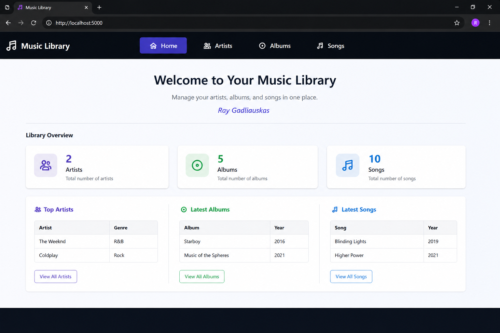

# Music Database Web App

A full-stack web application for managing artists, albums and songs, built using Node.js, Express, SQLite, HTML, CSS and JavaScript.

## Features

- View and manage artists
- View and manage albums
- View and manage songs
- Add, update and delete music records
- Store application data using SQLite
- Frontend interface connected to a Node.js and Express backend

## Technologies Used

- JavaScript
- Node.js
- Express
- SQLite
- HTML
- CSS

## Project Structure

- `backend/` - Node.js and Express server, API routes, controllers and database setup
- `frontend/` - HTML, CSS and JavaScript user interface
- `screenshot.png` - Screenshot of the application

## How It Works

The backend uses Node.js and Express to provide API routes for artists, albums and songs.

The application uses SQLite to store the music data.

The frontend uses HTML, CSS and JavaScript to display the data and communicate with the backend.

The project separates the routes and controllers to keep the backend code organised.

## Running the Project

Open a terminal and move into the backend folder:

cd backend

Install the required dependencies:

npm install

Start the backend server:

npm start

Then open:

frontend/index.html

in a web browser.

## Project Purpose

This project was created to practise full-stack development, API routing, database operations and connecting a frontend interface to a backend application.
